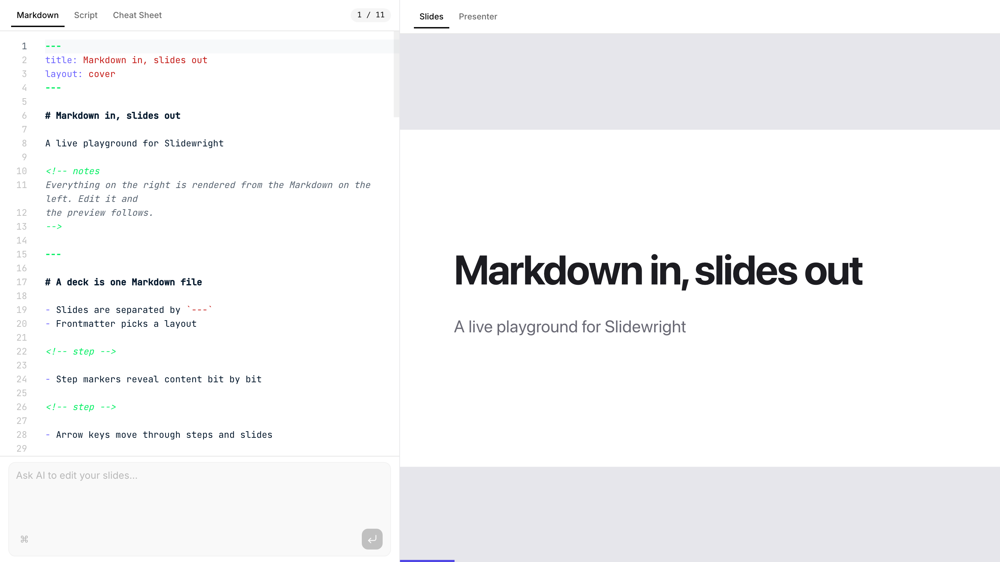

# Slidewright

[](https://www.npmjs.com/org/slidewright)
[](LICENSE)

Write presentations in Markdown, render them with React.



- **Markdown first.** One file, slides separated by `---`, per-slide
  frontmatter, speaker notes, step-by-step reveals and code highlighting.
- **Embeddable.** Drop `<Deck markdown={md} />` into any React app. The deck
  re-renders as the markdown changes, so it works for live editors, docs
  sites and CMS previews alike.
- **A full toolchain.** A CLI to present, build static sites and export PDFs,
  plus a browser editor with live preview.

> [!WARNING]
> Early release. Every API may change until 1.0. See the
> [roadmap](docs/ROADMAP.md) for what is planned and in progress, and the
> [changelog](CHANGELOG.md) for what changed in each version.

## Quick start

```sh
npm create @slidewright my-talk
cd my-talk
npm install
npm run dev
```

Requires Node.js 20.19, or 22.12 and later.

## Repository layout

| Path              | What it is                                  |
| ----------------- | ------------------------------------------- |
| `packages/core`   | Deck parser and slide compiler (no React)   |
| `packages/react`  | `<Deck>` component, layouts and themes      |
| `packages/vite`   | Vite plugin: serve and build a deck file    |
| `packages/cli`    | `slidewright` command: dev, build, export   |
| `packages/create` | `npm create @slidewright` project template  |
| `apps/playground` | Browser editor with live preview            |
| `apps/docs`       | Documentation site                          |
| `examples/`       | [Example decks](examples) and a React app   |
| `docs/`           | [Syntax reference](docs/syntax.md), roadmap |

## Development

Requires [Bun](https://bun.sh) 1.3+.

```sh
bun install
bun run dev        # start the playground on http://localhost:3000
bun run docs       # start the documentation site on http://localhost:4321
bun run typecheck  # type-check every workspace
bun run test       # run unit tests
bun run lint       # oxlint
bun run fmt        # oxfmt
bun run build      # build every workspace
```

See [CONTRIBUTING.md](CONTRIBUTING.md) before opening a pull request.

## License

[MIT](LICENSE)
