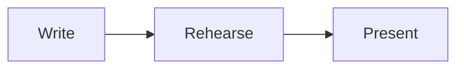

# Deck syntax

A deck is one Markdown file. This page is the reference for everything the
parser understands on top of
[GitHub Flavored Markdown](https://github.github.com/gfm/).

Design goals:

- **Reads well as plain Markdown.** Notes and steps are HTML comments, so a
  deck still looks sensible on GitHub or in any Markdown viewer.
- **Forgiving while you type.** Mistakes produce diagnostics instead of
  errors, and the rest of the deck keeps rendering.

## Slides

Slides are separated by a line containing only `---`.

```md
# First slide

---

# Second slide
```

- `---` inside a fenced code block is not a separator.
- Because `---` always separates slides, use `***` or `___` for a horizontal
  rule.
- A `---` at the end of the file does not create an empty slide.

## Frontmatter

A slide can start with a YAML block, written directly after its separator and
closed by another `---`:

```md
---
layout: two-cols
class: dense
---

# Comparing options
```

The block counts as frontmatter only if its **first line, immediately after
the separator, is a `key:` pair**. To start a slide with text such as
`Note: …`, leave a blank line after the separator.

Frontmatter is full YAML: nesting, lists and quoted strings all work. Invalid
YAML is reported as a diagnostic and the slide renders without settings.

### Slide keys

| Key      | Type   | Meaning                                                    |
| -------- | ------ | ---------------------------------------------------------- |
| `layout` | string | Layout to render the slide with. Defaults to `default`.    |
| `title`  | string | Slide title for navigation. Defaults to the first heading. |
| `steps`  | number | Overrides the number of steps counted on the slide.        |

Other keys are passed to the layout and renderer (for example `class` or
`image`). Their meaning is defined by the renderer: the README of
`@slidewright/react` lists its layouts and the keys they read.

## Headmatter

The frontmatter of the **first** slide, when the file starts with `---`,
configures the whole deck:

```md
---
title: Shipping faster
theme: default
aspectRatio: 16/9
defaults:
  layout: center
layout: cover
---

# Shipping faster
```

| Key           | Type                        | Default   | Meaning                                   |
| ------------- | --------------------------- | --------- | ----------------------------------------- |
| `title`       | string                      |           | Deck title.                               |
| `theme`       | string                      | `default` | Theme name.                               |
| `colorScheme` | `light` \| `dark` \| `auto` | `light`   | Colour scheme.                            |
| `aspectRatio` | `16/9`, `4:3`, `1.6`, …     | `16/9`    | Slide aspect ratio.                       |
| `canvasWidth` | number                      | `980`     | Slide width in CSS pixels before scaling. |
| `defaults`    | mapping                     | `{}`      | Frontmatter applied to every slide.       |

Slide keys in the headmatter (such as `layout` above) also apply to the first
slide. Unknown keys are kept for renderers and plugins.

## Speaker notes

Put notes in a `<!-- notes … -->` comment anywhere in the slide, starting on
a line of its own. Notes are Markdown, and several notes comments on one slide
are joined together.

```md
# Results

Revenue grew 40%.

<!-- notes
Pause here. Mention the churn numbers only if asked.
-->
```

### Notes for each step

A `[step]` line divides the notes by step. The text before the first marker
is for step 0, the text after the first marker for step 1, and so on, so a
presenter view can show what to say as each step appears.

```md
# Three reasons

- It's fast

<!-- step -->

- It's small

<!-- notes
There are two reasons, and the second one surprises people.
[step]
It's under 10 kB.
-->
```

A marker must be on its own line, outside code blocks. The number of markers
doesn't have to match the slide's steps.

## Steps

Steps reveal a slide bit by bit. Step `0` is what the audience sees first;
each "next" shows one more step before moving to the next slide.

### Step markers

`<!-- step -->` hides everything after it, up to the next marker, until the
next step:

```md
# Three reasons

- Speed

<!-- step -->

- Cost

<!-- step -->

- Safety
```

Markers apply **within their parent element**, so they also work inside raw
HTML and in the middle of a paragraph:

```md
<div class="grid grid-cols-2">

Always visible

<!-- step -->

Revealed on step 1

</div>

The answer is <!-- step --> **42**.
```

`<!-- step N -->` reveals at step `N` instead of the next step. Explicit
numbers don't affect automatic numbering. The slide's step count is the
highest step used, unless `steps` in the frontmatter overrides it.

### Code highlighting

A `{…}` block after the language highlights lines. Separate stages with `|`.
The first stage shows when the code block appears, and each later stage takes
one step:

````md
```ts {1|3-4|all}
const a = 1;

const b = 2;
const c = a + b;
```
````

- Lines: `3`, `3-5`, `1,3-5`, or `all` (also `*`).
- A single stage (`{2,4}`) is a static highlight and takes no steps.
- `@N` pins a stage to step `N`: `{1@2|3@4}`.

## Code blocks

Other options go after the language, in any order:

| Option         | Meaning                                              |
| -------------- | ---------------------------------------------------- |
| `{…}`          | Highlight stages (see above).                        |
| `lines`        | Show line numbers. `lines=10` starts counting at 10. |
| `title="name"` | Show a title, such as a file name, above the code.   |
| `diff`         | Mark lines as added (`+`) or removed (`-`).          |

````md
```ts {2} lines title="server.ts"
import { serve } from "./http";
serve({ port: 3000 });
```
````

### Diffs

In a `diff` block, a `+` or `-` at the start of a line marks it as added or
removed. The marker is taken out of the code, so the language's syntax colours
still apply, and the renderer shows it beside the line.

````md
```ts diff
function greet(name: string) {
-  return "Hello " + name;
+  return `Hello, ${name}!`;
}
```
````

- Lines from `git diff` can be pasted as they are: when every unchanged line
  starts with a space, that space is removed too. Leave out the `@@` and file
  header lines.
- Every line that starts with `+` or `-` is a change. To show an unchanged
  line such as `-1`, start each unchanged line with a space.
- Line numbers and `{…}` stages count every line, removed lines included.

## Directives

Block directives give names to regions of a slide. The renderer decides what a
name means:

- a **slot** of the slide's layout (for example `left` and `right` in a
  two-column layout),
- a **component** registered with the renderer,
- otherwise a plain `div` that you can style with CSS.

```md
---
layout: two-cols
---

# Before and after

:::left
Old checkout flow
:::

:::right{.highlight}
New checkout flow
:::

::video{src="demo.mp4"}
```

- `:::name` … `:::` wraps Markdown content. Nest by using more colons on the
  outer directive.
- `::name` is a single-line directive with no content.
- `{…}` holds attributes: `#id`, `.class`, `key="value"`.

Inline directives (`:name`) are **not** part of the syntax, so text like
`Note:this` or `10:30` stays as written.

Components are React components. With the CLI, they come from a
`components.tsx` file next to the deck; with the Vite plugin, from its
`components` option; in a React app, from the `components` prop of `<Deck>`.
See [Components](../packages/vite/README.md#components).

## HTML

Inline and block HTML work as in GitHub Flavored Markdown, and any element can
carry `class`, `style` and `data-*` attributes.

When a deck comes from an untrusted source, renderers sanitise the output by
default: scripts, event handlers, iframes and `javascript:` URLs are removed.
The attributes of directives lose event handlers, `srcdoc`, and
`javascript:` and `vbscript:` URLs. Trusted local decks can turn sanitising
off.

Sanitising also prefixes `id` and `name` attributes with `user-content-`, as
GitHub does, so they can't clash with the ids of the page around the deck.
`:::intro{#intro}` gets the id `user-content-intro`: style it with a class, or
select `#user-content-intro`.

## Maths

Inline maths uses `$…$`, and display maths uses `$$…$$` on lines of its own
(LaTeX syntax):

```md
Einstein: $E = mc^2$

$$
\int_0^1 x^2 \, dx = \frac{1}{3}
$$
```

A fenced code block with the language `math` is display maths too, as on
GitHub.

Renderers draw maths with [KaTeX](https://katex.org/docs/supported), so the
LaTeX that KaTeX supports is what a deck can use. LaTeX with a mistake shows
as its source, in red.

## Icons

`:set:name:` in text is an icon. The set and the name are those of
[Iconify](https://icon-sets.iconify.design), which has more than 200 open
icon sets:

```md
# :lucide:rocket: Launch day

- :lucide:circle-check: Tests pass
- :logos:github-icon: The code is public
```

- The set and the name are lower-case letters, digits and `-`, and the set
  starts with a letter. So a time such as `10:30:45:` is not an icon.
- An icon stands apart from the letters and digits next to it: `a:b:c:d` has
  no icon. Icons can follow each other: `:lucide:star::lucide:star:`.
- Icons work in headings, lists, tables, links and the text of HTML, and
  take steps like other content. In code and maths, the text stays as
  written: `` `:lucide:rocket:` `` shows the source.

An icon is as tall as the text around it. Most sets draw in the colour of
the text; some, such as `logos`, have colours of their own. To change the
size or the colour, style the element around the icon:

```md
<span style="color: crimson; font-size: 2em">:lucide:heart:</span>
```

The sets are separate packages. With the CLI and the Vite plugin, install
the ones that the deck uses (`npm install @iconify-json/lucide`); in a React
app, give `<Deck>` its `icons` prop. An icon that the renderer doesn't have
shows as its source text. See [Icons](../packages/vite/README.md#icons).

## Diagrams

A fenced code block with the language `mermaid` is a diagram, written in
[Mermaid](https://mermaid.js.org/intro/syntax-reference.html) syntax:

````md

````

Renderers draw the diagram in the colours and the font of its slide. A
diagram takes steps and goes in layout slots like any other block.

Mermaid is a separate package. With the CLI and the Vite plugin, install it
in the project (`npm install mermaid`); in a React app, give `<Deck>` its
`mermaid` prop. Without Mermaid, the block shows as code. See
[Diagrams](../packages/vite/README.md#diagrams).
