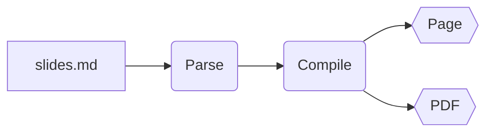
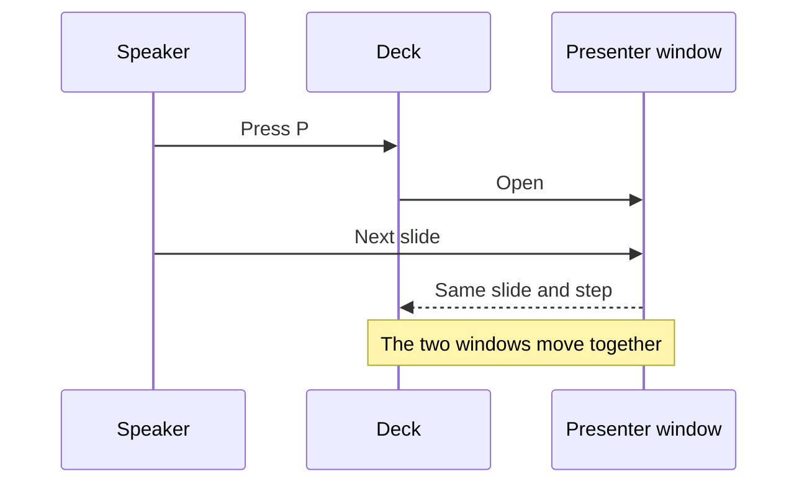
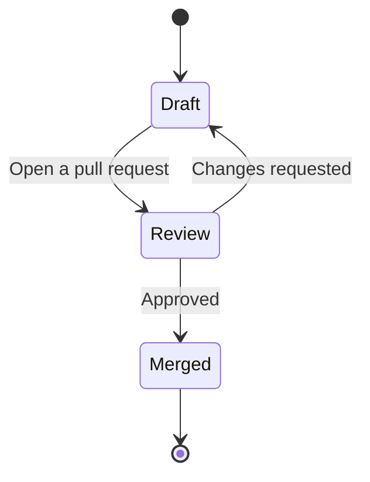
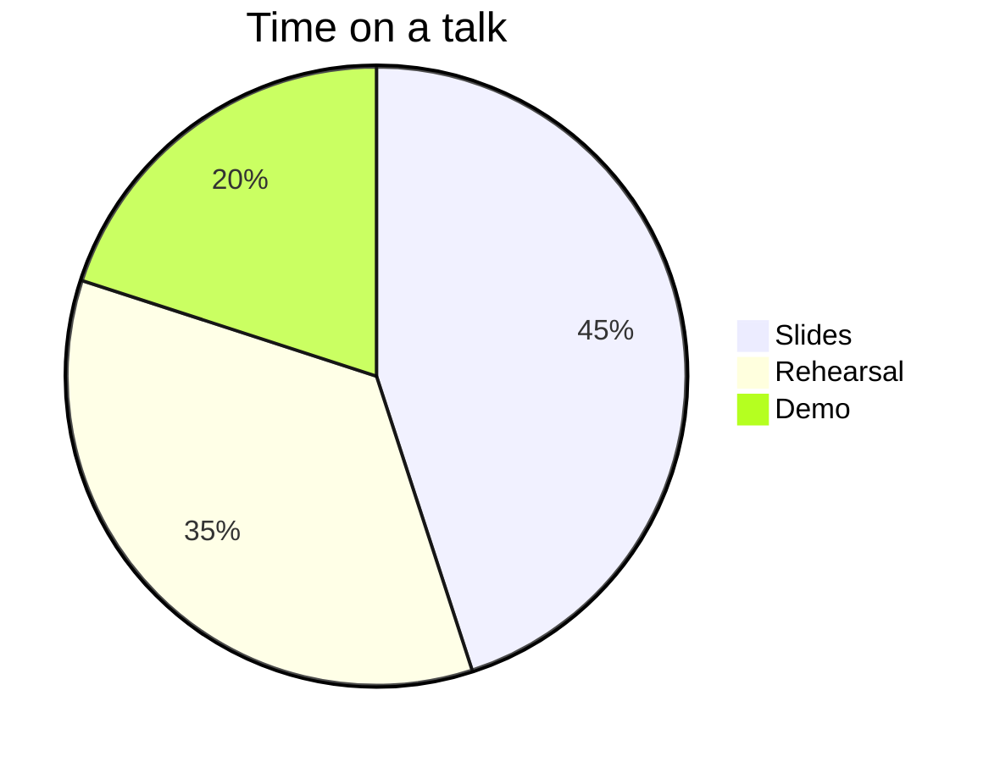

# Diagrams

Mermaid diagrams, written in the deck

---

# A flowchart

A `mermaid` code block is drawn as a diagram, in the deck's colours and font:

<!-- notes
The source of this diagram is five lines in slides.md. The project has
`mermaid` installed: without it, the block shows as code.
-->

---

# A sequence diagram

---
layout: two-cols
---

# Next to text

:::left

A diagram goes where a code block can go: in a column, in a slot of a
layout, or in a step.

<!-- step -->

It gets smaller when the slide has no more room.

:::

:::right

:::

---
class: night
---

# Its colours follow the slide

This slide sets other colours in `style.css`, and the diagram takes them.
