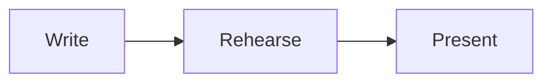

# @slidewright/vite

A Vite plugin that turns a Markdown deck into a presentation. The plugin
provides the page, so a project needs only the deck: no `index.html` and no
React code.

- `vite` serves the deck. Edits to the deck update the open page in place,
  on the same slide and step.
- `vite build` writes a static site that works from any folder of any host.

The deck format is documented in the [deck syntax reference](../../docs/syntax.md).

## Usage

```sh
npm install --save-dev vite @slidewright/vite
```

```ts
// vite.config.ts
import { defineConfig } from "vite";
import { slidewright } from "@slidewright/vite";

export default defineConfig({
  plugins: [slidewright({ deck: "slides.md", css: "style.css" })],
});
```

Then run `vite` to present, and `vite build` to build. The page renders
the deck with [`@slidewright/react`](../react/README.md), keeps the position
in the URL hash and listens to the keyboard anywhere on the page.

Requires Vite 8.

### Problems in the deck

The plugin prints problems in the deck as warnings, with the file and line:
invalid frontmatter, unknown layouts, and highlight ranges that code blocks
skip. It prints them when Vite starts and again when a saved change gives
different problems. The deck still renders, and the build still succeeds.

```text
slides.md:9: warning: Unknown layout "two-columns": the slide shows with the default layout. The layouts are default, center, …
```

## Options

| Option | Default     | Description                                                                                                 |
| ------ | ----------- | ----------------------------------------------------------------------------------------------------------- |
| `deck` | `slides.md` | The deck file, relative to the Vite root.                                                                   |
| `css`  |             | One or more stylesheets loaded after the default theme, relative to the Vite root. See [Styling](#styling). |

The type of the options is `SlidewrightOptions`.

## Diagrams

A `mermaid` code block is drawn as a diagram when the project has
[Mermaid](https://mermaid.js.org):

```sh
npm install --save-dev mermaid
```

````md

````

There is nothing to configure. The page loads Mermaid with the first diagram
that it shows, and the build puts Mermaid in files of their own. Diagrams
take the colours and the font of their slide, and export waits for them.

Without Mermaid, the block shows as code, and the plugin prints a warning
with the line of each diagram. Restart Vite after you install Mermaid.

How diagrams are sized and themed is in the
[`@slidewright/react` README](../react/README.md#diagrams).

## Styling

Stylesheets in `css` load after the default theme, so they can set theme
properties and style slide content with ordinary selectors:

```css
/* style.css */
[data-deck] {
  --deck-accent: #e11d48;
  --deck-font-sans: "Inter", sans-serif;
}

[data-slide] h1 {
  letter-spacing: -0.02em;
}
```

The theme properties and selectors are listed in the
[`@slidewright/react` README](../react/README.md#styling).

## Printing

Add `?print` to the address of the deck to see every slide at full size,
one after the other. Print the page, or save it as a PDF, from the browser:
each slide gets its own page, sized to the slide. `?print=steps` gives each
step its own page.

To export a PDF or PNG files from the command line, use
[`slidewright export`](../cli/README.md#export).

## Files

Refer to images and other files from the deck with a path from the Vite
root:

```md

```

The dev server serves them, and the build copies each file that the deck
refers to into the site, at the same path. The build finds them in Markdown
images and links, in the `src`, `poster` and `href` attributes of HTML, in
the attributes of directives, and in the `image` of a slide.

Files in the project's `public` folder go to the root of the site as they
are, as in any Vite project. Refer to them by name: `` shows
`public/logo.svg`.

The plugin sets Vite's `base` to `./` when the config doesn't set it, so the
built site works from any folder, such as `https://user.github.io/talk/`. A
path that starts with `/` points to the root of the host, so it breaks when
the site is in a folder.

The plugin replaces any `index.html` in the project with its own page.
