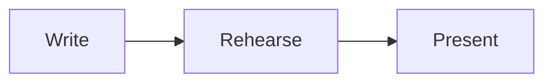

<!-- A copy of docs/syntax.md in the Slidewright repository, written by `bun run skills`. -->

# Deck syntax

A deck is one Markdown file, or [several](#several-files). This page tells
all that the parser reads in addition to
[GitHub Flavored Markdown](https://github.github.com/gfm/).

Design goals:

- **Easy to read as plain Markdown.** Notes and steps are HTML comments. So
  a deck also looks correct on GitHub or in any Markdown viewer.
- **Tolerant while you type.** A mistake gives a diagnostic, not an error.
  The rest of the deck continues to render.

## Slides

A line with only `---` starts a new slide.

```md
# First slide

---

# Second slide
```

- A `---` in a fenced code block does not start a slide.
- A `---` always starts a slide. For a horizontal rule, use `***` or `___`.
- A `---` at the end of the file does not make an empty slide.

## Frontmatter

A slide can start with a YAML block. Write the block directly after the
`---` of the slide, and close it with another `---`:

```md
---
layout: two-cols
class: dense
---

# Comparing options
```

The block is frontmatter only when its **first line, directly after the
`---`, is a `key:` pair**. To start a slide with text such as `Note: …`, put
a blank line after the `---`.

Frontmatter is full YAML: nested keys, lists and quoted strings work. When
the YAML is not valid, the parser gives a diagnostic. Then the slide renders
without settings.

### Slide keys

| Key      | Type   | Meaning                                                                             |
| -------- | ------ | ----------------------------------------------------------------------------------- |
| `layout` | string | The layout of the slide. The default is `default`.                                  |
| `title`  | string | The title of the slide in the navigation. The default is the first heading.         |
| `steps`  | number | The number of steps of the slide, in place of the number that the parser counts.    |
| `src`    | string | A file whose slides go in place of this slide. See [Several files](#several-files). |

The parser gives the other keys to the layout and the renderer, for example
`class`, `image` or [`transition`](#transitions). The renderer gives them
their meaning. The
[README of `@slidewright/react`](react.md#layouts) lists
its layouts and the keys that they read.

## Headmatter

When the file starts with `---`, the frontmatter of the **first** slide
gives the settings of the whole deck:

```md
---
title: Shipping faster
theme: default
aspectRatio: 16/9
defaults:
  layout: center
layout: cover
---

# Shipping faster
```

| Key           | Type                        | Default   | Meaning                                             |
| ------------- | --------------------------- | --------- | --------------------------------------------------- |
| `title`       | string                      |           | The title of the deck.                              |
| `theme`       | string                      | `default` | The name of the theme. See [Themes](#themes).       |
| `colorScheme` | `light` \| `dark` \| `auto` | `light`   | The colour scheme.                                  |
| `aspectRatio` | `16/9`, `4:3`, `1.6`, …     | `16/9`    | The aspect ratio of the slides.                     |
| `canvasWidth` | number                      | `980`     | The width of a slide in CSS pixels, before scaling. |
| `defaults`    | mapping                     | `{}`      | Frontmatter for every slide.                        |

Slide keys in the headmatter, such as `layout` above, also apply to the
first slide. The parser keeps unknown keys for renderers and plugins.

### Themes

`theme` gives the look of the deck: its colours, for light and for dark,
its fonts, and the look of some layouts.

| Theme      | Look                                                         |
| ---------- | ------------------------------------------------------------ |
| `default`  | Neutral greys and indigo                                     |
| `paper`    | Warm paper and ink, serif headings                           |
| `frost`    | Cool greys and teal, rounded corners, a glow on title slides |
| `contrast` | Black and white, bold headings, a contrast of 7:1 or more    |
| `vivid`    | Pink and violet, narrow headings, section slides in colour   |

A theme doesn't change the size of the text, so a deck that fits with one
theme fits with all of them. Another name is a theme of your own, written
in CSS. A name that has no CSS gives the default theme. See
[Themes](react.md#themes) in the README of
`@slidewright/react`.

## Several files

A long deck can keep its chapters in different files. A slide with `src` in
its frontmatter stands for the slides of that file:

```md
---
title: Shipping faster
---

# Shipping faster

---
src: chapters/why.md
---

---
src: chapters/how.md
class: how
---

---

# Thank you
```

- The path starts from the folder of the file that has the `src`. A path
  that starts with `/` starts from the root of the project. With the command
  line, the root is the folder of the deck.
- The other keys next to `src`, here `class`, go to each slide of the file.
  A slide that sets a key itself keeps its own value.
- A slide with `src` has no content of its own. The parser reports content
  after its frontmatter, and does not show it.
- A file can also have slides with `src`. So a chapter can bring in a part
  that other chapters share. A file can't include itself.
- A file can be in the deck more than one time.

A chapter is also a deck, and you can present it alone. Its headmatter can
have `defaults`. They apply to the slides of the chapter in all decks that
show them. The other deck settings come from the deck file: `theme`,
`colorScheme`, `aspectRatio` and `canvasWidth`. In a chapter, these settings
apply only when you present the chapter alone. The `title` in the headmatter
of a chapter is the title of its first slide.

When a file doesn't exist, the parser reports it on the line of its `src`.
The rest of the deck continues to render.

The [command line](cli.md) and the
[Vite plugin](vite.md#several-files) read `src`. The
parser doesn't read files: `parseDeck` takes one source. `joinDeck` from
[`@slidewright/core`](https://github.com/trafargarlaw/slidewright/blob/master/packages/core/README.md#decks-in-several-files)
makes that source from the files.

## Speaker notes

Put notes in a `<!-- notes … -->` comment. The comment can be anywhere in
the slide, but it must start on a line of its own. Notes are Markdown. When
a slide has more than one notes comment, the notes are joined.

```md
# Results

Revenue grew 40%.

<!-- notes
Pause here. Mention the churn numbers only if asked.
-->
```

### Notes for each step

A `[step]` line divides the notes by step. The text before the first marker
is for step 0. The text after the first marker is for step 1, and so on. So
a presenter view can show what to say at each step.

```md
# Three reasons

- It's fast

<!-- step -->

- It's small

<!-- notes
There are two reasons, and the second one surprises people.
[step]
It's under 10 kB.
-->
```

A marker must be on its own line, outside code blocks. The number of
markers can be different from the number of steps of the slide.

## Steps

Steps show a slide one part at a time. The audience sees step `0` first.
Each "next" shows one more step. After the last step, "next" goes to the
next slide.

### Step markers

`<!-- step -->` hides the content after it, up to the next marker. The
content shows at the next step:

```md
# Three reasons

- Speed

<!-- step -->

- Cost

<!-- step -->

- Safety
```

Markers apply **in their parent element**. So they also work in raw HTML
and in the middle of a paragraph:

```md
<div class="grid grid-cols-2">

Always visible

<!-- step -->

Revealed on step 1

</div>

The answer is <!-- step --> **42**.
```

`<!-- step N -->` shows its content at step `N`, not at the next step. A
marker with a number doesn't change the numbers of the markers without one.
The number of steps of the slide is the highest step that it uses. The
`steps` key in the frontmatter changes this number.

### Code highlighting

A `{…}` block after the language highlights lines. Use `|` between stages.
The first stage shows when the code block shows. Each stage after it takes
one step:

````md
```ts {1|3-4|all}
const a = 1;

const b = 2;
const c = a + b;
```
````

- Lines: `3`, `3-5`, `1,3-5`, or `all` (also `*`).
- One stage alone, such as `{2,4}`, is a static highlight. It takes no
  steps.
- `@N` puts a stage on step `N`: `{1@2|3@4}`.

## Transitions

`transition` in the frontmatter of a slide tells how the slide comes in:

```md
---
transition: slide
---

# Next, the numbers
```

| Name       | The slide comes in                             |
| ---------- | ---------------------------------------------- |
| `none`     | Immediately. This is the default.              |
| `fade`     | Fading in, while the slide before fades out.   |
| `slide`    | From the right, pushing the slide before away. |
| `slide-up` | From the bottom, pushing the slide before up.  |
| `zoom`     | Growing and fading in.                         |

- Towards an earlier slide, the transition plays in the other direction. A
  slide that came in from the right goes out to the right.
- A jump between two slides plays the transition of the later slide.
- To give every slide a transition, put it in the `defaults` of the
  headmatter. A slide with its own `transition`, such as `none`, keeps it.

```md
---
defaults:
  transition: fade
---
```

Transitions play in the deck that the audience sees. They don't play in the
presenter view, in print or in an export. When the system asks for reduced
motion, the slides change immediately.

Renderers can have more names. With `@slidewright/react`, a name that the
theme doesn't have is a transition of your own, written in CSS. See
[Transitions](react.md#transitions).

## Code blocks

More options go after the language, in any sequence:

| Option         | Meaning                                                        |
| -------------- | -------------------------------------------------------------- |
| `{…}`          | Highlight stages. See [Code highlighting](#code-highlighting). |
| `lines`        | Show line numbers. `lines=10` starts the count at 10.          |
| `title="name"` | Show a title, such as a file name, above the code.             |
| `diff`         | Mark lines as added (`+`) or removed (`-`).                    |

````md
```ts {2} lines title="server.ts"
import { serve } from "./http";
serve({ port: 3000 });
```
````

### Diffs

In a `diff` block, a `+` or `-` at the start of a line marks the line as
added or removed. The parser removes the marker from the code, so the syntax
colours of the language still apply. The renderer shows the marker next to
the line.

````md
```ts diff
function greet(name: string) {
-  return "Hello " + name;
+  return `Hello, ${name}!`;
}
```
````

- You can paste lines from `git diff` without changes. When every unchanged
  line starts with a space, the parser also removes that space. Do not
  paste the `@@` lines and the file header lines.
- Every line that starts with `+` or `-` is a change. To show an unchanged
  line such as `-1`, start each unchanged line with a space.
- Line numbers and `{…}` stages count every line, also the removed lines.

## Directives

Block directives give names to parts of a slide. The renderer decides what
a name means:

- a **slot** of the layout of the slide, for example `left` and `right` in
  a layout with two columns
- a **component** that the renderer knows
- if not one of these, a plain `div` that you can style with CSS.

```md
---
layout: two-cols
---

# Before and after

:::left
Old checkout flow
:::

:::right{.highlight}
New checkout flow
:::

::video{src="demo.mp4"}
```

- `:::name` … `:::` puts a wrapper around Markdown content. To put a
  directive in a directive, give the outer directive more colons.
- `::name` is a directive on one line, with no content.
- `{…}` holds attributes: `#id`, `.class`, `key="value"`.

Inline directives (`:name`) are **not** part of the syntax. So text such as
`Note:this` or `10:30` stays as written.

A deck is Markdown, not MDX. It has no `import` lines, no JSX and no
`{expressions}`. So braces and `<` in text stay as written. A component is
a React component that a React app gives to `<Deck>`, in its
[`components` prop](react.md#components). With the CLI
and the Vite plugin, a directive is a slot, or a `div` to style.
[ADR 0001](https://github.com/trafargarlaw/slidewright/blob/master/docs/adr/0001-decks-are-markdown-not-mdx.md) gives the reasons.

## HTML

Inline HTML and HTML blocks work as in GitHub Flavored Markdown. All
elements can have `class`, `style` and `data-*` attributes.

When a deck comes from a source that you don't trust, renderers sanitise
the output by default. They remove scripts, event handlers, iframes and
`javascript:` URLs. From the attributes of directives, they remove event
handlers, `srcdoc`, and `javascript:` and `vbscript:` URLs. For a local deck
that you trust, you can turn sanitising off.

Sanitising also adds `user-content-` before each `id` and `name` attribute,
as GitHub does. So they can't have the same value as an id of the page
around the deck. `:::intro{#intro}` gets the id `user-content-intro`. To
style it, give it a class, or use the selector `#user-content-intro`.

## Maths

Write inline maths between `$` signs. Write display maths between `$$`
lines. Both use LaTeX syntax:

```md
Einstein: $E = mc^2$

$$
\int_0^1 x^2 \, dx = \frac{1}{3}
$$
```

A fenced code block with the language `math` is also display maths, as on
GitHub.

Two `$` signs on one line make maths of the text between them. So for
money, write `\$`: `from \$5 to \$10`. One `$` sign alone stays as written.

Renderers draw maths with [KaTeX](https://katex.org/docs/supported). So a
deck can use the LaTeX that KaTeX supports. LaTeX with a mistake shows as
its source, in red.

## Icons

`:set:name:` in text is an icon. The set and the name are those of
[Iconify](https://icon-sets.iconify.design), which has more than 200 open
icon sets:

```md
# :lucide:rocket: Launch day

- :lucide:circle-check: Tests pass
- :logos:github-icon: The code is public
```

- The set and the name have lower-case letters, digits and `-`. The set
  starts with a letter. So a time such as `10:30:45:` is not an icon.
- An icon is separate from the letters and digits next to it: `a:b:c:d` has
  no icon. Icons can follow each other: `:lucide:star::lucide:star:`.
- Icons work in headings, lists, tables, links and the text of HTML. They
  take steps like other content. In code and maths, the text stays as
  written: `` `:lucide:rocket:` `` shows the source.

An icon is as tall as the text around it. Most sets draw in the colour of
the text. Some sets, such as `logos`, have their own colours. To change the
size or the colour, style the element around the icon:

```md
<span style="color: crimson; font-size: 2em">:lucide:heart:</span>
```

Each icon set is a separate package. With the CLI and the Vite plugin,
install the sets that the deck uses, such as `@iconify-json/lucide`. In a
React app, give the sets to the `icons` prop of `<Deck>`. When the renderer
doesn't have an icon, the icon shows as its source text. See
[Icons](vite.md#icons).

## Diagrams

A fenced code block with the language `mermaid` is a diagram. Write it in
[Mermaid](https://mermaid.js.org/intro/syntax-reference.html) syntax:

````md

````

Renderers draw the diagram in the colours and the font of its slide. A
diagram takes steps and goes in layout slots, as other blocks do.

Mermaid is a separate package. With the CLI and the Vite plugin, install
the `mermaid` package in the project. In a React app, give Mermaid to the
`mermaid` prop of `<Deck>`. Without Mermaid, the block shows as code. See
[Diagrams](vite.md#diagrams).
