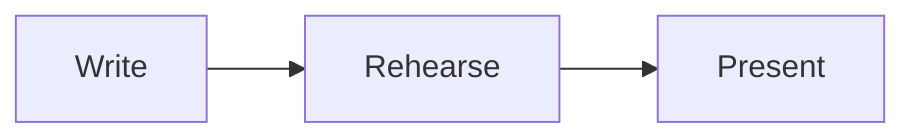

<!-- A copy of packages/vite/README.md in the Slidewright repository, written by `bun run skills`. -->

# @slidewright/vite

A Vite plugin that makes a presentation from a Markdown deck. The plugin
gives the page, so a project needs only the deck. It needs no `index.html`
and no React code.

- `vite` serves the deck. When you save the deck, the open page changes
  immediately, on the same slide and step.
- `vite build` writes a static site that works from any folder of any host.

The [deck syntax reference](syntax.md) tells the deck format.

## Usage

Install Vite and the plugin:

```sh
npm install --save-dev vite @slidewright/vite
```

Add the plugin to the Vite config:

```ts
// vite.config.ts
import { defineConfig } from "vite";
import { slidewright } from "@slidewright/vite";

export default defineConfig({
  plugins: [slidewright({ deck: "slides.md", css: "style.css" })],
});
```

To present the deck, run this command:

```sh
npx vite
```

To build the deck into a static site in the `dist` folder, run this command:

```sh
npx vite build
```

The page renders the deck with [`@slidewright/react`](react.md).
It keeps the position in the URL hash, and takes keys from all the page.

You need Vite 8.

### Problems in the deck

The plugin prints problems in the deck as warnings, with the file and the
line. These are the problems:

- frontmatter that is not valid
- unknown layouts
- highlight ranges that are not in their code block
- icons that the project doesn't have
- [files of the deck](#several-files) that are missing.

The plugin prints the problems when Vite starts. When you save a change
that gives different problems, it prints them again. The deck still
renders, and the build still succeeds.

```text
slides.md:9: warning: Unknown layout "two-columns": the slide shows with the default layout. The layouts are default, center, …
```

## Options

| Option | Default     | Description                                                                                     |
| ------ | ----------- | ----------------------------------------------------------------------------------------------- |
| `deck` | `slides.md` | The deck file, from the Vite root. It can bring in [other files](#several-files).               |
| `css`  |             | One or more stylesheets that load after the theme, from the Vite root. See [Styling](#styling). |

The type of the options is `SlidewrightOptions`.

## Several files

A deck can keep its chapters in different files. A slide with `src` in its
frontmatter stands for the slides of that file:

```md
---
src: chapters/why.md
---
```

You don't have to configure anything. The plugin joins the files into one
deck. When you save a change to one of the files, the open page shows it,
on the same slide and step. The
[deck syntax reference](syntax.md#several-files) gives the
rules.

- The path of `src` starts from the folder of the file that has it. A path
  that starts with `/` starts from the Vite root.
- The plugin prints a problem in a chapter with the file and the line of
  the chapter.
- When a file doesn't exist, the plugin prints an error, and leaves out the
  slides of the file. When the file is there, the page gets its slides.
- In all the files of the deck, the paths of images and other
  [files](#files) start from the Vite root. They don't start from the
  folder of a chapter.

```text
slides.md:8: error: No file `chapters/intro.md`: its slides are left out. The path is from the folder of this file.
chapters/why.md:12: warning: Unknown layout "two-columns": the slide shows with the default layout. The layouts are default, center, …
```

## Diagrams

The page draws a `mermaid` code block as a diagram when the project has
[Mermaid](https://mermaid.js.org). Install it:

```sh
npm install --save-dev mermaid
```

Then write a diagram in the deck:

````md

````

You don't have to configure anything. The page loads Mermaid with the first
diagram that it shows. The build puts Mermaid in separate files. Diagrams
get the colours and the font of their slide, and export waits for them.

Without Mermaid, the block shows as code, and the plugin prints a warning
with the line of each diagram. After you install Mermaid, start Vite again.

The [`@slidewright/react` README](react.md#diagrams) tells how to
set the size and the colours of diagrams.

## Icons

`:set:name:` in the text of the deck is an icon from an
[Iconify](https://icon-sets.iconify.design) set. Install each set that the
deck uses, as `@iconify-json/<set>`. For example, to install the `lucide`
set, run this command:

```sh
npm install --save-dev @iconify-json/lucide
```

Then write an icon in the deck:

```md
# :lucide:rocket: Launch day
```

You don't have to configure anything. The plugin reads the deck, and gives
the page only the icons that the deck uses. The page doesn't get all the
set, which has thousands of icons. When you install a set while Vite runs,
the plugin finds it at the next change to the deck.

Some icons show as their source text: an icon of a set that is not
installed, or a name that the set doesn't have. For each one, the plugin
prints a warning with its line:

```text
slides.md:3: warning: The icon `:lucide:rockt:` shows as text: the `lucide` icons have no `rockt`. The names are at https://icon-sets.iconify.design/lucide/.
```

The [`@slidewright/react` README](react.md#icons) tells how to set
the size and the colour of icons, and how to give them a name for screen
readers.

## Styling

To use a built-in theme, such as `paper`, `frost`, `contrast` or `vivid`,
set `theme` in the headmatter of the deck. The stylesheets in `css` load
after the theme, and their rules win over it. So they can change theme
properties, and style the content of slides with usual selectors:

```css
/* style.css */
[data-deck] {
  --deck-accent: #e11d48;
  --deck-font-sans: "Inter", sans-serif;
}

[data-slide] h1 {
  letter-spacing: -0.02em;
}
```

The [`@slidewright/react` README](react.md#styling) lists the
themes, the theme properties and the selectors.

## Printing

Add `?print` to the address of the deck. The page then shows all the slides
at full size, one after the other. To get a PDF, print the page or save it
as a PDF from the browser. Each slide gets its own page, with the size of
the slide. With `?print=steps`, each step gets its own page.

To export a PDF or PNG files from the command line, use
[`slidewright export`](cli.md#export).

## Files

To show images and other files in the deck, write their path from the Vite
root:

```md

```

The dev server serves these files. The build copies each file that the
deck refers to into the site, at the same path. The build finds the files
in these places:

- Markdown images and links
- the `src`, `poster` and `href` attributes of HTML
- the attributes of directives
- the `image` of a slide.

Files in the `public` folder of the project go to the root of the site with
no change, as in all Vite projects. Refer to them by name:
`` shows `public/logo.svg`.

When the config doesn't set the Vite `base`, the plugin sets it to `./`. So
the built site works from any folder, such as
`https://user.github.io/talk/`. A path that starts with `/` goes to the root
of the host. So it breaks when the site is in a folder.

The plugin replaces an `index.html` in the project with its own page.
