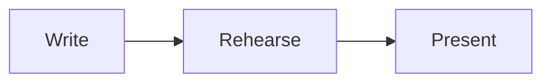

<!-- A copy of packages/vite/README.md in the Slidewright repository, written by `bun run skills`. -->

# @slidewright/vite

A Vite plugin that turns a Markdown deck into a presentation. The plugin
provides the page, so a project needs only the deck: no `index.html` and no
React code.

- `vite` serves the deck. Edits to the deck update the open page in place,
  on the same slide and step.
- `vite build` writes a static site that works from any folder of any host.

The deck format is documented in the [deck syntax reference](syntax.md).

## Usage

```sh
npm install --save-dev vite @slidewright/vite
```

```ts
// vite.config.ts
import { defineConfig } from "vite";
import { slidewright } from "@slidewright/vite";

export default defineConfig({
  plugins: [slidewright({ deck: "slides.md", css: "style.css" })],
});
```

Then run `vite` to present, and `vite build` to build. The page renders
the deck with [`@slidewright/react`](react.md), keeps the position
in the URL hash and listens to the keyboard anywhere on the page.

Requires Vite 8.

### Problems in the deck

The plugin prints problems in the deck as warnings, with the file and line:
invalid frontmatter, unknown layouts, highlight ranges that code blocks
skip, icons that the project doesn't have, and
[files of the deck](#several-files) that are missing. It prints them when
Vite starts and again when a saved change gives different problems. The deck
still renders, and the build still succeeds.

```text
slides.md:9: warning: Unknown layout "two-columns": the slide shows with the default layout. The layouts are default, center, …
```

## Options

| Option       | Default     | Description                                                                                                             |
| ------------ | ----------- | ----------------------------------------------------------------------------------------------------------------------- |
| `deck`       | `slides.md` | The deck file, relative to the Vite root. It can bring in [other files](#several-files).                                |
| `css`        |             | One or more stylesheets loaded after the default theme, relative to the Vite root. See [Styling](#styling).             |
| `components` |             | A module with the React components for the deck's directives, relative to the Vite root. See [Components](#components). |

The type of the options is `SlidewrightOptions`.

## Several files

A deck can keep its chapters in files of their own. A slide with `src` in
its frontmatter stands for the slides of that file:

```md
---
src: chapters/why.md
---
```

There is nothing to configure. The plugin joins the files into one deck, and
a saved change to any of them shows in the open page, on the same slide and
step. The rules are in the
[deck syntax reference](syntax.md#several-files).

- The path of `src` is from the folder of the file that has it. A path that
  starts with `/` is from the Vite root.
- A problem in a chapter is printed with the chapter's file and line.
- A file that doesn't exist is printed as an error, and its slides are left
  out. The page gets them when the file is there.
- The paths of images and other [files](#files) are from the Vite root in
  every file of the deck, not from the folder of a chapter.

```text
slides.md:8: error: No file `chapters/intro.md`: its slides are left out. The path is from the folder of this file.
chapters/why.md:12: warning: Unknown layout "two-columns": the slide shows with the default layout. The layouts are default, center, …
```

## Components

A deck can use React components through
[directives](syntax.md#directives). Put the components in a
module, and give its path in `components`:

```ts
slidewright({ deck: "slides.md", components: "components.tsx" });
```

The default export of the module is an object of components by directive
name. A component gets the directive's attributes as string props and its
content as `children`:

```tsx
// components.tsx
import { useState, type ReactNode } from "react";

function Callout({
  tone = "info",
  children,
}: {
  tone?: string;
  children?: ReactNode;
}) {
  return <aside className={`callout ${tone}`}>{children}</aside>;
}

function Counter({ label = "Count" }: { label?: string }) {
  const [count, setCount] = useState(0);
  return (
    <button type="button" onClick={() => setCount(count + 1)}>
      {label}: {count}
    </button>
  );
}

export default { callout: Callout, counter: Counter };
```

```md
:::callout{tone="warning"}
Mind the **gap**.
:::

::counter{label="Hands up"}
```

The module is part of the page: it can import other modules, stylesheets and
packages, and a saved change shows in the open page. JSX works in `.tsx` and
`.jsx` files without more config.

The components use the React that renders the deck, so the project doesn't
need `react` installed. For types in the editor, install `@types/react`. The
type of the default export is `DirectiveComponents`, from
`@slidewright/react`.

How directives render, and what sanitising removes from their attributes, is
in the [`@slidewright/react` README](react.md#components).

## Diagrams

A `mermaid` code block is drawn as a diagram when the project has
[Mermaid](https://mermaid.js.org):

```sh
npm install --save-dev mermaid
```

````md

````

There is nothing to configure. The page loads Mermaid with the first diagram
that it shows, and the build puts Mermaid in files of their own. Diagrams
take the colours and the font of their slide, and export waits for them.

Without Mermaid, the block shows as code, and the plugin prints a warning
with the line of each diagram. Restart Vite after you install Mermaid.

How diagrams are sized and themed is in the
[`@slidewright/react` README](react.md#diagrams).

## Icons

`:set:name:` in the text of the deck is an icon from an
[Iconify](https://icon-sets.iconify.design) set. Install the sets that the
deck uses, each as `@iconify-json/<set>`:

```sh
npm install --save-dev @iconify-json/lucide
```

```md
# :lucide:rocket: Launch day
```

There is nothing to configure. The plugin reads the deck and gives the page
only the icons that it uses, not their sets, which have thousands. A set
that you install while Vite runs is found the next time the deck changes.

An icon whose set is not installed, or whose name the set doesn't have,
shows as its source text, and the plugin prints a warning with its line:

```text
slides.md:3: warning: The icon `:lucide:rockt:` shows as text: the `lucide` icons have no `rockt`. The names are at https://icon-sets.iconify.design/lucide/.
```

How icons are sized, coloured and named for screen readers is in the
[`@slidewright/react` README](react.md#icons).

## Styling

Stylesheets in `css` load after the default theme, so they can set theme
properties and style slide content with ordinary selectors:

```css
/* style.css */
[data-deck] {
  --deck-accent: #e11d48;
  --deck-font-sans: "Inter", sans-serif;
}

[data-slide] h1 {
  letter-spacing: -0.02em;
}
```

The theme properties and selectors are listed in the
[`@slidewright/react` README](react.md#styling).

## Printing

Add `?print` to the address of the deck to see every slide at full size,
one after the other. Print the page, or save it as a PDF, from the browser:
each slide gets its own page, sized to the slide. `?print=steps` gives each
step its own page.

To export a PDF or PNG files from the command line, use
[`slidewright export`](cli.md#export).

## Files

Refer to images and other files from the deck with a path from the Vite
root:

```md

```

The dev server serves them, and the build copies each file that the deck
refers to into the site, at the same path. The build finds them in Markdown
images and links, in the `src`, `poster` and `href` attributes of HTML, in
the attributes of directives, and in the `image` of a slide.

Files in the project's `public` folder go to the root of the site as they
are, as in any Vite project. Refer to them by name: `` shows
`public/logo.svg`.

The plugin sets Vite's `base` to `./` when the config doesn't set it, so the
built site works from any folder, such as `https://user.github.io/talk/`. A
path that starts with `/` points to the root of the host, so it breaks when
the site is in a folder.

The plugin replaces any `index.html` in the project with its own page.
